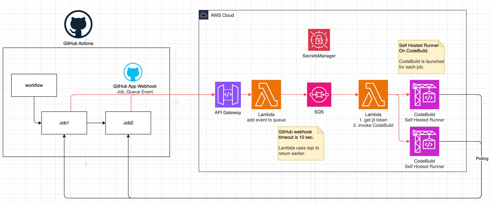

# GitHub Self-Hosted-Runner On AWS



A serverless solution to run GitHub Actions self-hosted runners on AWS, using **CodeBuild**, **Lambda**, and **GitHub App**.  

---

## ✨ Features

- 🧩 **Ephemeral Runner per Job**: Each GitHub job triggers a new CodeBuild runner  
- 🔐 **Secure GitHub App Auth**: App credentials stored in AWS Secrets Manager  
- ⚙️ **Event-Driven Architecture**: Triggered via GitHub Webhook → Lambda → SQS → CodeBuild

---

## 🚀 Getting Started

### Requirements

- Node.js (v16+)
- AWS CLI
- AWS Account
- AWS CDK

### Setup

1. **Install dependencies**

   ```bash
   npm install
   ```
2. Create a GitHub App
- Create an App on GitHub
- Set required permissions
- Download private key, note App ID

3. Store credentials in Secrets Manager
   ```bash
   ./upload-github-app-secret.sh <secret-name> <path-to-key.pem> <app-id>
   ```

4. Deploy CDK stack
   ```bash
   npm run build
   cdk deploy
   ```

## 🛠 Usage
- Configure GitHub Webhook to your API Gateway endpoint
- Use runs-on: [self-hosted] in your GitHub Actions workflows
- Lambda receives the event, triggers a short-lived runner via CodeBuild

## 📄 License
This project is licensed under the MIT License.

---
